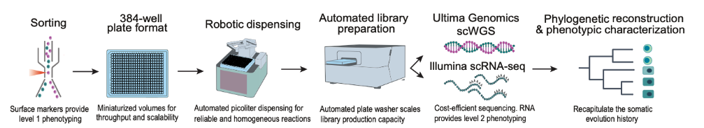

# SMART-PTA

[](https://github.com/jzinno/darkshore/actions/workflows/docker-build.yml)

### Nextflow pipeline
in support of the preprint: [Large scale single-cell phylogenetic mapping of clonal evolution in the human aging esophagus](https://www.biorxiv.org/content/10.1101/2025.10.11.681805v1)



## Quick start & Test run

```bash
   git clone https://github.com/jzinno/darkshore.git

   cd darkshore

   nextflow workflows/scVC.nf -stub-run -profile stub

   #explore example output
   tree -C output
```

## Installation

### Requirements

These workflows were developed using the following:

- Nextflow 22.10.4+
- Singularity 3.8.6+

The pipelines will automatically pull the required containers when run. Our reference data bundle is required in order to run the pipelines, in order to download the required files run:

```bash
   cd resources
   ./ref_setup.sh
```

More information on the reference data bundle can be found [here](https://github.com/jzinno/darkshore/tree/main/resources).

## Usage

### scVariantCalling (`scVC.nf`)

This will run the following steps:

- Duplicate Marking
- Contamination Estimate
- UG DeepVariant
- GLNexus joint genotyping
- Variant Annotation

Create a bam list

```bash
   #e.g. bam_list.txt
   /path/to/bam1.bam
   /path/to/bam2.bam
   /path/to/bam3.bam
```

```bash
   nextflow workflows/scVC.nf --bam_list <bam_list> --sample_id <sample_id>
```

A version of the pipeline targeting Illumina data is also availible `workflows/scVC-il.nf`. The input of this version is a list of paired fastq files.

```bash
   #e.g. fq_list.txt
   /path/to/fastq1_R1.fastq.gz /path/to/fastq1_R2.fastq.gz
   /path/to/fastq2_R1.fastq.gz /path/to/fastq2_R2.fastq.gz
   /path/to/fastq3_R1.fastq.gz /path/to/fastq3_R2.fastq.gz
```

```bash
   nextflow workflows/scVC-il.nf --fq_list <fq_list> --sample_id <sample_id>
```

### scRNAseq Analysis (`scRNA.nf`)

This will run the following steps:

- Quality control with FastP
- Alignment with STAR
- Quantification with HTSeq
- Merging of counts
- Quality control report with MultiQC

Create an RNA-seq fastq list

```bash
   #e.g. rna_fastq_pairs.txt
   /path/to/fastq1_R1.fastq.gz /path/to/fastq1_R2.fastq.gz
   /path/to/fastq2_R1.fastq.gz /path/to/fastq2_R2.fastq.gz
   /path/to/fastq3_R1.fastq.gz /path/to/fastq3_R2.fastq.gz
```

```bash
nextflow workflows/scRNA.nf --rna_fastq_table <rna_fastq_pairs> --sample_id <sample_id>
```
## Citation
```bibtex
@article{Prieto2025,
  author = {Prieto, Tamara and Yuan, Dennis J and Zinno, John and Hughes, Clayton and Midler, Nicholas and Kao, Sheng and Huuhtanen, Jani and Raviram, Ramya and Fotopoulou, Fenia and Ruthen, Neil and Rajagopalan, Srinivas and Schiffman, Joshua S and D Avino, Andrew R and Yoon, Sang-Ho and Sotelo, Jesus and Omans, Nathaniel D and Wheeler, Noelle and Garces, Alejandro and Pradhan, Barun and Cheng, Alexandre Pellan and Robine, Nicolas and Potenski, Catherine and Godfrey, Katharine and Kakiuchi, Nobuyuki and Yokoyama, Akira and Ogawa, Seishi and Abrams, Julian and Raimondi, Ivan and Landau, Dan A},
  title = {Large-scale single-cell phylogenetic mapping of clonal evolution in the human aging esophagus},
  year = {2025},
  doi = {10.1101/2025.10.11.681805},
  journal = {bioRxiv}
}
```